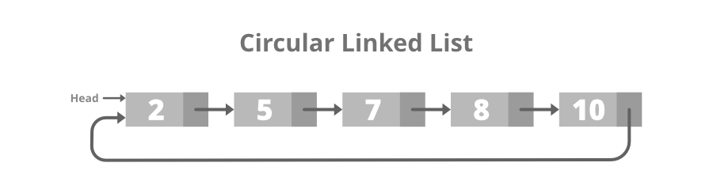

# <h1 align="center">Laporan Praktikum Modul Linked List Circular dan Non Circular</h1>
<p align="center">Naya Putwi Setiasih_2311102155</p>

## Dasar Teori
1. Linked List Non Circular
Linked list non circular merupakan linked list dengan node pertama (head) dan 
node terakhir (tail) yang tidak saling terhubung. Pointer terakhir (tail) pada Linked 
List ini selalu bernilai ‘NULL’ sebagai pertanda data terakhir dalam list-nya. linked list non circular lebih mudah untuk diterapkan dan dipahami. linked list non circular memungkinkan operasi penyisipan dan penghapusan yang efisien, karena setiap node hanya perlu menyimpan alamat node next di dalam list. linked list non circular juga bisa dikonversikan menjadi array atau struktur data lainnya.

- Deklarasi Simpul (Node)
```c++
struct node
{
    int data;
    node *next;
};
```
- Menginisialisasi Pointer Head dan Tail
```c++
node *head, *tail;
void init()
{
    head = NULL;
    tail = NULL;
};
```
- Pengecekan kondisi linked list
```c++
bool isEmpty()
{
    if (head == NULL && tail == NULL)
    {
        return true;
    }
    else
    {
        return false;
    }
}
```
- Penambahan Simpul (Node)
```c++
void insertBelakang(string dataUser)
{
    if (isEmpty() == true)
    {
        node *baru = new node;
        baru->data = dataUser;
        head = baru;
        tail = baru;
        baru->next = NULL;
    }
    else
    {
        node *baru = new node;
        baru->data = dataUser;
        baru->next = NULL;
        tail->next = baru;
        tail = baru;
    }
};
```
- Penghapusan Simpul(Node)
```c++
void hapusDepan()
{
    if (isEmpty() == true)
    {
        cout << "List kosong!" << endl;
    }
    else
    {
        node *helper;
        helper = head;
        if (head == tail)
        {
            head = NULL;
            tail = NULL;
            delete helper;
        }
        else
            head = head->next;
        helper->next = NULL;
        delete helper;
        }
    }
}
```
- Tampil Data Linked List
```c++
void tampil()
{
    if (isEmpty() == true)
    {
        cout << "List kosong!" << endl;
    }
    else
    {
        node *helper;
        helper = head;
        while (helper != NULL)
        {
            cout << helper->data << ends;
            helper = helper->next;
        }
    }
}
```
2. Linked List Circular
Circular Linked List adalah suatu data structure yang merupakan variasi dari linked list biasa. Dalam sebuah linked list, setiap node terhubung dengan node berikutnya melalui pointer next. Namun, dalam sebuah circular linked list, pointer next dari node terakhir akan menunjuk ke node pertama, sehingga list tidak akan berakhir.
- Deklarasi Simpul (Node)
```c++
struct Node
{
    string data;
    Node *next;
};
```
- Menginisialisasi Pointer Head dan Tail
```c++
Node *head, *tail, *baru, *bantu, *hapus;
void init()
{
    head = NULL;
    tail = head;
}
```
- Pengecekan Kondisi Linked List
```c++
int isEmpty()
{
    if (head == NULL)
        return 1; // true
    else
        return 0; // false
}
```
- Pembuatan Simpul(Node)
```c++
void buatNode(string data)
{
    baru = new Node;
    baru->data = data;
    baru->next = NULL;
}
```
- Penambahan Simpul(Node)
```c++
// Tambah Depan
void insertDepan(string data)
{
    // Buat Node baru
    buatNode(data);
    if (isEmpty() == 1)
    {
        head = baru;
        tail = head;
        baru->next = head;
    }
    else
    {
        while (tail->next != head)
        {
            tail = tail->next;
        }
        baru->next = head;
        head = baru;
        tail->next = head;
    }
}
```
- Penghapusan Simpul(Node)
```c++
void hapusBelakang()
{
    if (isEmpty() == 0)
    {
        hapus = head;
        tail = head;
        if (hapus->next == head)
        {
            head = NULL;
            tail = NULL;
            delete hapus;
        }
        else
        {
            while (hapus->next != head)
            {
                hapus = hapus->next;
            }
            while (tail->next != hapus)
            {
                tail = tail->next;
            }
            tail->next = head;
            hapus->next = NULL;
            delete hapus;
        }
}
```
- Menampilkan Data Linked List
```c++
void tampil()
{
    if (isEmpty() == 0)
    {
        tail = head;
        do
        {
            cout << tail->data << ends;
            tail = tail->next;
        } while (tail != head);
        cout << endl;
    }
}
```

## Guided 

### 1. [Linked List Non Circular]

```C++
#include <iostream>
using namespace std;
/// PROGRAM SINGLE LINKED LIST NON-CIRCULAR
// Deklarasi Struct Node
struct Node
{
    int data;
    Node *next;
};
Node *head;
Node *tail;
// Inisialisasi Node
void init()
{
    head = NULL;
    tail = NULL;
}
// Pengecekan
bool isEmpty()
{
    if (head == NULL)
        return true;
    else
        return false;
}
// Tambah Depan
void insertDepan(int nilai)
{
    // Buat Node baru
    Node *baru = new Node;
    baru->data = nilai;
    baru->next = NULL;
    if (isEmpty() == true)
    {
        head = tail = baru;
        tail->next = NULL;
    }
    else
    {
        baru->next = head;
        head = baru;
    }
}
// Tambah Belakang
void insertBelakang(int nilai)
{
    // Buat Node baru
    Node *baru = new Node;
    baru->data = nilai;
    baru->next = NULL;
    if (isEmpty() == true)
    {
        head = tail = baru;
        tail->next = NULL;
    }
    else
    {
        tail->next = baru;
        tail = baru;
    }
}
// Hitung Jumlah List
int hitungList()
{
    Node *hitung;
    hitung = head;
    int jumlah = 0;
    while (hitung != NULL)
    {
        jumlah++;
        hitung = hitung->next;
    }
    return jumlah;
}
// Tambah Tengah
void insertTengah(int data, int posisi)
{
    if (posisi < 1 || posisi > hitungList())
    {
        cout << "Posisi diluar jangkauan" << endl;
    }
    else if (posisi == 1)
    {
        cout << "Posisi bukan posisi tengah" << endl;
    }
    else
    {
        Node *baru, *bantu;
        baru = new Node();
        baru->data = data;
        // tranversing
        bantu = head;
        int nomor = 1;
        while (nomor < posisi - 1)
        {
            bantu = bantu->next;
            nomor++;
        }
        baru->next = bantu->next;
        bantu->next = baru;
    }
}
// Hapus Depan
void hapusDepan()
{
    Node *hapus;
    if (isEmpty() == false)
    {
        if (head->next != NULL)
        {
            hapus = head;
            head = head->next;
            delete hapus;
        }
        else
        {
            head = tail = NULL;
        }
    }
    else
    {
        cout << "List kosong!" << endl;
    }
}
// Hapus Belakang
void hapusBelakang()
{
    Node *hapus;
    Node *bantu;
    if (isEmpty() == false)
    {
        if (head != tail)
        {
            hapus = tail;
            bantu = head;
            while (bantu->next != tail)
            {
                bantu = bantu->next;
            }
            tail = bantu;
            tail->next = NULL;
            delete hapus;
        }
        else
        {
            head = tail = NULL;
        }
    }

    else
    {
        cout << "List kosong!" << endl;
    }
}
// Hapus Tengah
void hapusTengah(int posisi)
{
    Node *bantu, *hapus, *sebelum;
    if (posisi < 1 || posisi > hitungList())
    {
        cout << "Posisi di luar jangkauan" << endl;
    }
    else if (posisi == 1)
    {
        cout << "Posisi bukan posisi tengah" << endl;
    }
    else
    {
        int nomor = 1;
        bantu = head;
        while (nomor <= posisi)
        {
            if (nomor == posisi - 1)
            {
                sebelum = bantu;
            }
            if (nomor == posisi)
            {
                hapus = bantu;
            }
            bantu = bantu->next;
            nomor++;
        }
        sebelum->next = bantu;
        delete hapus;
    }
}
// Ubah Depan
void ubahDepan(int data)
{
    if (isEmpty() == 0)
    {
        head->data = data;
    }
    else
    {
        cout << "List masih kosong!" << endl;
    }
}
// Ubah Tengah
void ubahTengah(int data, int posisi)
{
    Node *bantu;
    if (isEmpty() == 0)
    {
        if (posisi < 1 || posisi > hitungList())
        {
            cout << "Posisi di luar jangkauan" << endl;
        }
        else if (posisi == 1)
        {
        }
        else
        {
            cout << "Posisi bukan posisi tengah" << endl;
            bantu = head;
            int nomor = 1;
            while (nomor < posisi)
            {
                bantu = bantu->next;
                nomor++;
            }
            bantu->data = data;
        }
    }
    else
    {
        cout << "List masih kosong!" << endl;
    }
}
// Ubah Belakang
void ubahBelakang(int data)
{
    if (isEmpty() == 0)
    {
        tail->data = data;
    }
    else
    {
        cout << "List masih kosong!" << endl;
    }
}
// Hapus List
void clearList()
{
    Node *bantu, *hapus;
    bantu = head;
    while (bantu != NULL)
    {
        hapus = bantu;
        bantu = bantu->next;
        delete hapus;
    }
    head = tail = NULL;
    cout << "List berhasil terhapus!" << endl;
}
// Tampilkan List
void tampil()
{
    Node *bantu;
    bantu = head;
    if (isEmpty() == false)
    {
        while (bantu != NULL)
        {
            cout << bantu->data << ends;
            bantu = bantu->next;
        }
        cout << endl;
    }
    else
    {
        cout << "List masih kosong!" << endl;
    }
}
int main()
{
    init();
    insertDepan(3);
    tampil();
    insertBelakang(5);
    tampil();
    insertDepan(2);
    tampil();
    insertDepan(1);
    tampil();
    hapusDepan();
    tampil();
    hapusBelakang();
    tampil();
    insertTengah(7, 2);
    tampil();
    hapusTengah(2);
    tampil();
    ubahDepan(1);
    tampil();
    ubahBelakang(8);
    tampil();
    ubahTengah(11, 2);
    tampil();
    return 0;
}
```
Program diatas mengimplementasikan darisebuah linked list non circular dalam bahasa C++.
- "struct Node" ->  untuk merepresentasikan node dalam linked list. Setiap node memiliki dua anggota, yaitu data yang menyimpan nilai integer, dan next yang merupakan pointer ke node berikutnya dalam linked list.
- "Node *head" dan "Node *tail" -> pointer yang menunjuk ke kepala (head) dan ekor (tail) dari linked list. Mereka digunakan untuk menunjukkan awal dan akhir dari linked list.
- "init()" -> digunakan untuk menginisialisasi linked list dengan mengatur "head" dan "tail" menjadi "NULL".
- "isEmpty()" -> memeriksa apakah linked list kosong atau tidak.
- "insertDepan(int nilai)" -> digunakan untuk menambahkan node baru di depan linked list.
- "insertBelakang(int nilai)" -> digunakan untuk menambahkan node baru di belakang linked list.
- "hitungList()" -> Fungsi ini menghitung jumlah node dalam linked list.
- "insertTengah(int data, int posisi)" -> digunakan untuk menambahkan node baru di posisi tertentu dalam linked list.
- "hapusDepan()", "hapusBelakang()", "hapusTengah(int posisi)" -> digunakan untuk menghapus node dari depan, belakang, atau dari posisi tertentu dalam linked list.
- "ubahDepan(int data)", "ubahTengah(int data, int posisi)", "ubahBelakang(int data)" -> digunakan untuk mengubah nilai data dari node di depan, tengah, atau belakang linked list.
- "clearList()" -> digunakan untuk menghapus seluruh node dari linked list.
- "tampil()" -> digunakan untuk menampilkan isi linked list.
- "main()" -> fungsi utama program yang melakukan pengujian terhadap berbagai fungsi yang didefinisikan di atas dengan melakukan operasi-operasi seperti penyisipan, penghapusan, dan pengubahan node dalam linked list serta menampilkan isi linked list setelah setiap operasi.

### 2. [Linked List Circular]
```c++
#include <iostream>
using namespace std;

// Deklarasi Struct Node
struct Node
{
    string data;
    Node* next;
};

Node* head, * tail, * baru, * bantu, * hapus;

void init()
{
    head = NULL;
    tail = head;
}

// Pengecekan
int isEmpty()
{
    if (head == NULL)
        return 1; // true
    else
        return 0; // false
}

// Buat Node Baru
void buatNode(string data)
{
    baru = new Node;
    baru->data = data;
    baru->next = NULL;
}

// Hitung List
int hitungList()
{
    bantu = head;
    int jumlah = 0;
    while (bantu != NULL)
    {
        jumlah++;
        bantu = bantu->next;
    }
    return jumlah;
}

// Tambah Depan
void insertDepan(string data)
{
    // Buat Node baru
    buatNode(data);

    if (isEmpty() == 1)
    {
        head = baru;
        tail = head;
        baru->next = head;
    }
    else
    {
        while (tail->next != head)
        {
            tail = tail->next;
        }
        baru->next = head;
        head = baru;
        tail->next = head;
    }
}

// Tambah Belakang
void insertBelakang(string data)
{
    // Buat Node baru
    buatNode(data);

    if (isEmpty() == 1)
    {
        head = baru;
        tail = head;
        baru->next = head;
    }
    else
    {
        while (tail->next != head)
        {
            tail = tail->next;
        }
        tail->next = baru;
        baru->next = head;
    }
}

// Tambah Tengah
void insertTengah(string data, int posisi)
{
    if (isEmpty() == 1)
    {
        head = baru;
        tail = head;
        baru->next = head;
    }
    else
    {
        baru->data = data;
        // transversing
        int nomor = 1;
        bantu = head;
        while (nomor < posisi - 1)
        {
            bantu = bantu->next;
            nomor++;
        }
        baru->next = bantu->next;
        bantu->next = baru;
    }
}

// Hapus Depan
void hapusDepan()
{
    if (isEmpty() == 0)
    {
        hapus = head;
        tail = head;
        if (hapus->next == head)
        {
            head = NULL;
            tail = NULL;
            delete hapus;
        }
        else
        {
            while (tail->next != hapus)
            {
                tail = tail->next;
            }
            head = head->next;
            tail->next = head;
            hapus->next = NULL;
            delete hapus;
        }
    }
    else
    {
        cout << "List masih kosong!" << endl;
    }
}

// Hapus Belakang
void hapusBelakang()
{
    if (isEmpty() == 0)
    {
        hapus = head;
        tail = head;
        if (hapus->next == head)
        {
            head = NULL;
            tail = NULL;
            delete hapus;
        }
        else
        {
            while (hapus->next != head)
            {
                hapus = hapus->next;
            }
            while (tail->next != hapus)
            {
                tail = tail->next;
            }
            tail->next = head;
            hapus->next = NULL;
            delete hapus;
        }
    }
    else
    {
        cout << "List masih kosong!" << endl;
    }
}

// Hapus Tengah
void hapusTengah(int posisi)
{
    if (isEmpty() == 0)
    {
        // transversing
        int nomor = 1;
        bantu = head;
        while (nomor < posisi - 1)
        {
            bantu = bantu->next;
            nomor++;
        }
        hapus = bantu->next;
        bantu->next = hapus->next;
        delete hapus;
    }
    else
    {
        cout << "List masih kosong!" << endl;
    }
}

// Hapus List
void clearList()
{
    if (head != NULL)
    {
        hapus = head->next;
        while (hapus != head)
        {
            bantu = hapus->next;
            delete hapus;
            hapus = bantu;
        }
        delete head;
        head = NULL;
    }
    cout << "List berhasil terhapus!" << endl;
}

// Tampilkan List
void tampil()
{
    if (isEmpty() == 0)
    {
        tail = head;
        do
        {
            cout << tail->data << ends;
            tail = tail->next;
        } while (tail != head);
        cout << endl;
    }
    else
    {
        cout << "List masih kosong!" << endl;
    }
}

int main()
{
    init();
    insertDepan("Ayam");
    tampil();
    insertDepan("Bebek");
    tampil();
    insertBelakang("Cicak");
    tampil();
    insertBelakang("Domba");
    tampil();
    hapusBelakang();
    tampil();
    hapusDepan();
    tampil();
    insertTengah("Sapi", 2);
    tampil();
    hapusTengah(2);
    tampil();
    return 0;
}
```
Program ini mengimplementasikan single linked list non-circular dalam bahasa pemrograman C++. Single linked list merupakan struktur data yang terdiri dari sejumlah node yang saling terhubung melalui pointer, dengan setiap node menyimpan data serta pointer menuju node berikutnya.
Dalam program ini, terdapat beberapa fungsi utama untuk mengelola linked list. Pertama adalah fungsi inisialisasi ('init') yang mengatur pointer 'head' dan 'tail' menjadi NULL, menandakan bahwa linked list masih kosong. Selanjutnya, fungsi 'isEmpty' digunakan untuk memeriksa apakah linked list kosong atau tidak dengan mengecek apakah pointer 'head' adalah NULL. Fungsi ini mengembalikan nilai true jika linked list kosong, dan false jika tidak.
Selanjutnya, terdapat fungsi-fungsi untuk penambahan data ke linked list. Fungsi 'insertDepan' dan 'insertBelakang' bertugas menambahkan node baru dengan nilai tertentu di bagian depan dan belakang linked list. Fungsi 'hitungList' digunakan untuk menghitung jumlah total node yang ada dalam linked list.
Untuk penyisipan pada posisi tertentu, program memiliki fungsi 'insertTengah' yang menyisipkan node baru pada posisi yang ditentukan dalam linked list. Sedangkan untuk penghapusan data, terdapat fungsi 'hapusDepan', 'hapusBelakang', dan 'hapusTengah' yang menghapus node dari linked list sesuai dengan posisi yang diinginkan.
Selain itu, program juga memiliki fungsi-fungsi untuk mengubah nilai data pada node tertentu dalam linked list. Fungsi 'ubahDepan', 'ubahTengah', dan 'ubahBelakang' digunakan untuk mengubah nilai data pada node-node tersebut.
Terakhir, program ini mencakup contoh penggunaan fungsi-fungsi tersebut dalam main function. Melalui serangkaian operasi seperti penambahan, penghapusan, pengubahan data node, serta menampilkan isi linked list setelah setiap operasi dilakukan.

## Unguided 

### 1. [Buatlah program menu Linked List Non Circular untuk menyimpan Nama dan NIMmahasiswa, dengan menggunakan input dari user]

```C++
#include <iostream>
#include <string>
using namespace std;

class Node {
public:
    string nama_Naya155;
    string nim_Naya155;
    Node* next;

    Node(string nama_Naya155, string nim_Naya155) {
        this->nama_Naya155 = nama_Naya155;
        this->nim_Naya155 = nim_Naya155;
        this->next = nullptr;
    }
};

class LinkedList {
private:
    Node* head;

public:
    LinkedList() {
        head = nullptr;
    }

    void tambahDepan(string nama_Naya155, string nim_Naya155) {
        Node* newNode = new Node(nama_Naya155, nim_Naya155);
        newNode->next = head;
        head = newNode;
    }

    void tambahBelakang(string nama_Naya155, string nim_Naya155) {
        Node* newNode = new Node(nama_Naya155, nim_Naya155);
        if (head == nullptr) {
            head = newNode;
            return;
        }
        Node* temp = head;
        while (temp->next != nullptr) {
            temp = temp->next;
        }
        temp->next = newNode;
    }

    void tambahTengah(string nama_Naya155, string nim_Naya155, int posisi_Naya155) {
        if (posisi_Naya155 < 1) {
            cout << "Posisi tidak valid." << endl;
            return;
        }
        Node* newNode = new Node(nama_Naya155, nim_Naya155);
        if (posisi_Naya155 == 1) {
            newNode->next = head;
            head = newNode;
            return;
        }
        Node* temp = head;
        for (int i = 1; i < posisi_Naya155 - 1; i++) {
            if (temp == nullptr) {
                cout << "Posisi tidak valid." << endl;
                return;
            }
            temp = temp->next;
        }
        newNode->next = temp->next;
        temp->next = newNode;
    }

    void hapusDepan() {
        if (head == nullptr) {
            cout << "Linked list kosong." << endl;
            return;
        }
        Node* temp = head;
        head = head->next;
        delete temp;
        cout << "Data di depan telah dihapus." << endl;
    }

    void hapusBelakang() {
        if (head == nullptr) {
            cout << "Linked list kosong." << endl;
            return;
        }
        if (head->next == nullptr) {
            delete head;
            head = nullptr;
            cout << "Data terakhir telah dihapus." << endl;
            return;
        }
        Node* temp = head;
        while (temp->next->next != nullptr) {
            temp = temp->next;
        }
        delete temp->next;
        temp->next = nullptr;
        cout << "Data terakhir telah dihapus." << endl;
    }

    void hapusTengah(int posisi_Naya155) {
        if (posisi_Naya155 < 1) {
            cout << "Posisi tidak valid." << endl;
            return;
        }
        if (posisi_Naya155 == 1) {
            hapusDepan();
            return;
        }
        Node* temp = head;
        for (int i = 1; i < posisi_Naya155 - 1; i++) {
            if (temp == nullptr || temp->next == nullptr) {
                cout << "Posisi tidak valid." << endl;
                return;
            }
            temp = temp->next;
        }
        Node* nodeToDelete = temp->next;
        temp->next = temp->next->next;
        delete nodeToDelete;
        cout << "Data pada posisi " << posisi_Naya155 << " telah dihapus." << endl;
    }
    void ubahDepan(string namaBaru, string nimBaru) {
        if (head == nullptr) {
            cout << "Linked list kosong." << endl;
            return;
        }
        head->nama_Naya155 = namaBaru;
        head->nim_Naya155 = nimBaru;
        static bool pesanDitampilkan = false;
        if (!pesanDitampilkan) {
            cout << "Data di depan telah diubah." << endl;
            pesanDitampilkan = true;
        }
    }
    void ubahBelakang(string namaBaru, string nimBaru) {
        if (head == nullptr) {
            cout << "Linked list kosong." << endl;
            return;
        }
        Node* temp = head;
        while (temp->next != nullptr) {
            temp = temp->next;
        }
        temp->nama_Naya155 = namaBaru;
        temp->nim_Naya155 = nimBaru;
        static bool pesanDitampilkan = false;
        if (!pesanDitampilkan) {
            cout << "Data terakhir telah diubah." << endl;
            pesanDitampilkan = true;
        }
    }
    void ubahTengah(string namaBaru, string nimBaru, int posisi) {
        if (posisi < 1) {
            cout << "Posisi tidak valid." << endl;
            return;
        }
        Node* temp = head;
        for (int i = 1; i < posisi; i++) {
            if (temp == nullptr) {
                cout << "Posisi tidak valid." << endl;
                return;
            }
            temp = temp->next;
        }
        string namaLama = temp->nama_Naya155;
        temp->nama_Naya155 = namaBaru;
        temp->nim_Naya155 = nimBaru;
        cout << "Data (" << namaLama << ") telah diubah menjadi (" << namaBaru << ")." << endl;
    }

    void hapusList() {
        Node* temp = head;
        while (temp != nullptr) {
            Node* nextNode = temp->next;
            delete temp;
            temp = nextNode;
        }
        head = nullptr;
        cout << "Seluruh data telah dihapus." << endl;
    }

    void tampilkan() {
        Node* temp = head;
        cout << "DATA MAHASISWA" << endl;
        cout << "NAMA\tNIM" << endl;
        while (temp != nullptr) {
            cout << temp->nama_Naya155 << "\t" << temp->nim_Naya155 << endl;
            temp = temp->next;
        }
    }
};

int main() {
    LinkedList linkedList;

    while (true) {
        cout << "\nPROGRAM SINGLE LINKED LIST NON-CIRCULAR" << endl;
        cout << "1. Tambah Depan" << endl;
        cout << "2. Tambah Belakang" << endl;
        cout << "3. Tambah Tengah" << endl;
        cout << "4. Ubah Depan" << endl;
        cout << "5. Ubah Belakang" << endl;
        cout << "6. Ubah Tengah" << endl;
        cout << "7. Hapus Depan" << endl;
        cout << "8. Hapus Belakang" << endl;
        cout << "9. Hapus Tengah" << endl;
        cout << "10. Hapus List" << endl;
        cout << "11. Tampilkan Data" << endl;
        cout << "0. Keluar" << endl;
        int pilih;
        cout << endl;
        cout << "Pilih Operasi: ";
        cin >> pilih;
        cout << endl;

        if (pilih == 1) {
            string nama_Naya155, nim_Naya155;
            cout << "Tambah depan\n";
            cin.ignore(); // Menggunakan cin.ignore() agar getline() bekerja dengan benar setelah cin
            cout << "Masukkan Nama: ";
            getline(cin, nama_Naya155);
            cout << "Masukkan NIM: ";
            cin >> nim_Naya155;
            linkedList.tambahDepan(nama_Naya155, nim_Naya155);
            cout << "Data telah ditambahkan" << endl;
        }
        else if (pilih == 2) {
            string nama_Naya155, nim_Naya155;

            cin.ignore(); // Menggunakan cin.ignore() agar getline() bekerja dengan benar setelah cin
            cout << "Masukkan Nama: ";
            getline(cin, nama_Naya155);
            cout << "Masukkan NIM: ";
            cin >> nim_Naya155;
            linkedList.tambahBelakang(nama_Naya155, nim_Naya155);
            cout << "Data telah ditambahkan" << endl;
        }
        else if (pilih == 3) {
            string nama_Naya155, nim_Naya155;
            int posisi_naya155;
            cin.ignore(); // Menggunakan cin.ignore() agar getline() bekerja dengan benar setelah cin
            cout << "Masukkan Nama: ";
            getline(cin, nama_Naya155);
            cout << "Masukkan NIM: ";
            cin >> nim_Naya155;
            cout << "Masukkan Posisi: ";
            cin >> posisi_naya155;
            linkedList.tambahTengah(nama_Naya155, nim_Naya155, posisi_naya155);
            cout << "Data telah ditambahkan" << endl;
        }
        else if (pilih == 4) {
            string namaBaru, nimBaru;
            cout << "Ubah Depan\n";
            cout << endl;
            cin.ignore(); // Menggunakan cin.ignore() agar getline() bekerja dengan benar setelah cin
            cout << "Masukkan Nama Baru: ";
            getline(cin, namaBaru);
            cout << "Masukkan NIM Baru: ";
            cin >> nimBaru;
            cout << endl;
            linkedList.ubahDepan(namaBaru, nimBaru);
        }
        else if (pilih == 5) {
            string namaBaru, nimBaru;
            cout << "Ubah Belakang\n";
            cout << endl;
            cin.ignore(); // Menggunakan cin.ignore() agar getline()  bekerja dengan benar setelah cin
            cout << "Masukkan Nama Baru: ";
            getline(cin, namaBaru);
            cout << "Masukkan NIM Baru: ";
            cin >> nimBaru;
            cout << endl;
            linkedList.ubahBelakang(namaBaru, nimBaru);
        }
        else if (pilih == 6) {
            string namaBaru, nimBaru;
            cout << "Ubah Tengah\n";
            cout << endl;
            int posisi;
            cin.ignore(); // Menggunakan cin.ignore() agar getline() bekerja dengan benar setelah cin
            cout << "Masukkan Nama Baru: ";
            getline(cin, namaBaru);
            cout << "Masukkan NIM Baru: ";
            cin >> nimBaru;
            cout << "Masukkan Posisi: ";
            cin >> posisi;
            linkedList.ubahTengah(namaBaru, nimBaru, posisi);
        }
        else if (pilih == 7) {
            linkedList.hapusDepan();
        }
        else if (pilih == 8) {
            linkedList.hapusBelakang();
        }
        else if (pilih == 9) {
            int posisi_Naya155;
            cout << "Masukkan Posisi: ";
            cin >> posisi_Naya155;
            linkedList.hapusTengah(posisi_Naya155);
        }
        else if (pilih == 10) {
            linkedList.hapusList();
        }
        else if (pilih == 11) {
            cout << "Tampilkan List\n";
            cout << endl;
            linkedList.tampilkan();
        }
        else if (pilih == 0) {
            cout << "Program selesai." << endl;
            break;
        }
        else {
            cout << "Pilihan tidak valid. Silakan coba lagi." << endl;
        }
    }

    return 0;
}
```
#### Output:
### Tampilan Menu 
 
### Tambah Depan

### Tambah Belakang

### Tambah Tengah

### Hapus Depan

### Hapus Tengah

### Hapus Belakang

### Ubah Depan
Depan
### Ubah Belakang

### Ubah Tengah

### Tampilan Data


### 2. Setelah membuat menu tersebut, masukkan data sesuai urutan berikut, lalu 
tampilkan data yang telah dimasukkan. (Gunakan insert depan, belakang atau 
tengah)


### 3. Lakukan perintah berikut :
### a. Tambahkan data berikut diantara Farrel dan Denis
### Wati : 2330004

### b. Hapus data Denis

### c. Tambahkan data berikut di awal :
### Owi : 2330000

### d. tambahkan data berikut di akhir :
### David : 23300100

### e. Ubah data Udin menjadi data berikut ini :
### Idin : 23300045

### f. Ubah data terakhir menjadi berikut :
### Lucy : 23300101

### g. Hapus data awal

### h. Ubah data awal menjadi berikut :
### Bagas : 2330002

### i. Hapus data akhir

### j. Tampilkan seluruh data


Program ini adalah implementasi dari struktur data linked list non-circular dalam bahasa pemrograman C++. Linked list adalah struktur data linear yang terdiri dari simpul-simpul yang saling terhubung melalui pointer. Setiap simpul memiliki dua data utama, yaitu nama dan NIM mahasiswa, serta sebuah pointer yang menunjuk ke simpul berikutnya.
Dalam program ini, terdapat dua kelas utama yaitu `Node` dan `LinkedList`. Kelas `Node` digunakan untuk merepresentasikan satu simpul dalam linked list, dengan atribut untuk menyimpan nama, NIM, dan pointer ke simpul berikutnya. Sementara itu, kelas `LinkedList` digunakan untuk mengelola seluruh linked list, dengan atribut `head` sebagai pointer ke simpul pertama.
Program ini menyediakan berbagai operasi dasar yang dapat dilakukan pada linked list:
1) Operasi Tambah
• `tambahDepan(string nama, string nim)` digunakan untuk menambahkan simpul baru di depan linked list.
• `tambahBelakang(string nama, string nim)` digunakan untuk menambahkan simpul baru di belakang linked list.
• `tambahTengah(string nama, string nim, int posisi)` digunakan untuk menambahkan simpul baru pada posisi tertentu dalam linked list.
2) Operasi Ubah
• `ubahDepan(string namaBaru, string nimBaru)` digunakan untuk mengubah data pada simpul pertama dalam linked list.
• `ubahBelakang(string namaBaru, string nimBaru)` digunakan untuk mengubah data pada simpul terakhir dalam linked list.
• `ubahTengah(string namaBaru, string nimBaru, int posisi)` digunakan untuk mengubah data pada simpul yang berada pada posisi tertentu dalam linked list.
3) Operasi Hapus
• `hapusDepan()` digunakan untuk menghapus simpul pertama dalam linked list.
• `hapusBelakang()` digunakan untuk menghapus simpul terakhir dalam linked list.
• `hapusTengah(int posisi)` digunakan untuk menghapus simpul pada posisi tertentu dalam linked list.
• `hapusList()` digunakan untuk menghapus seluruh isi linked list.
4) Operasi Tampilkan
`tampilkan()` digunakan untuk menampilkan seluruh data mahasiswa yang tersimpan dalam linked list.Dengan menggunakan menu operasi yang disediakan, pengguna dapat dengan mudah mengelola data mahasiswa dalam linked list, seperti menambah, mengubah, menghapus, dan menampilkan data sesuai dengan kebutuhan aplikasi.

## Kesimpulan
Melalui materi praktikum ini, mahasiswa memperoleh pemahaman yang mendalam tentang penggunaan struktur data Linked List dalam pemrograman, baik dalam bentuk Linked List circular maupun non-circular.Linked List non-circular adalah struktur data linear yang terdiri dari simpul-simpul yang saling terhubung satu arah (dari simpul pertama ke simpul terakhir). Melalui contoh program di atas, mahasiswa diajarkan bagaimana cara mengelola data dengan Linked List non-circular, seperti menambah, mengubah, menghapus, dan menampilkan data dengan efisien.Sementara itu, Linked List circular adalah struktur data di mana simpul terakhir terhubung kembali ke simpul pertama, membentuk lingkaran. Konsep Linked List circular memberikan keuntungan tertentu dalam pemrosesan data, terutama dalam kasus-kasus di mana akses data secara berulang diperlukan atau dalam implementasi antrian sirkular.Dengan memahami kedua jenis Linked List dan perbedaan antara circular dan non-circular, mahasiswa dapat mengembangkan keterampilan dalam memilih struktur data yang sesuai dengan kebutuhan aplikasi, serta mengimplementasikan operasi-operasi yang diperlukan dengan efisien dan efektif. Selain itu, penggunaan Linked List juga membuka kemungkinan untuk pemrosesan data yang lebih kompleks dan fleksibel.

## Referensi
[1] S. Ravikiran A, (2023). Types og Linked List in Data Structure.
[2] Drozdek, A. (2019). Data Structures and Algorithms in C++. Cengage Learning. Chapter 4 covers linked lists and their implementation in C++.