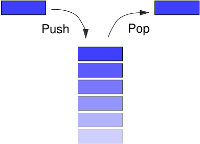

# <h1 align="center">Laporan Praktikum Modul Stack</h1>
<p align="center">Naya Putwi Setiasih_2311102155</p>

## Dasar Teori

Stack adalah sebuah kumpulan data dimana data yang diletakkan di atas data  yang lain. Dengan demikian stack adalah struktur data yang menggunakan konsep LIFO(Last In First Out). Dengan demikian, elemen terakhir yang disimpan dalam stack menjadi elemen pertama yang diambil. Dalam proses komputasi, untuk meletakkan sebuah elemen pada bagian atas dari stack, maka dilakukan operasi push. Dan untuk memindahkan dari tempat yang atas tersebut, maka dilakukan operasi pop.



## Guided 

### 1. [Stack]

```C++
#include <iostream>
using namespace std;

string arrayBuku[5];
int maksimal = 5, top = 0;

bool isFull() {
    return (top == maksimal);
}
bool isEmpty() {
    return (top == 0);
}

void pushArrayBuku(string data) {
    if (isFull()) {
        cout << "Data telah penuh" << endl;
    } else {
        arrayBuku[top] = data;
        top++;
    }
}

void popArrayBuku() {
    if (isEmpty()) {
        cout << "Tidak ada data yang dihapus" << endl;
    } else {
        arrayBuku[top - 1] = ' ';
        top--;
    }
}

void peekArrayBuku(int posisi) {
    if (isEmpty()) {
        cout << "Tidak ada data yang dapat di lihat" << endl;
    } else {
        int index = top;
        for (int i = 1; i <= posisi; i++) {
            index--;
        }
        cout << "posisi ke " << posisi << " adalah " << arrayBuku[index] << endl;
    }
}

int countStack() {
    return top;
}

void chargeArrayBuku(int posisi, string data) {
    if (posisi > top) {
        cout << "Posisi melebihi data yang ada" << endl;
    } else {
        int index = top;
        for (int i = 1; i <= posisi; i++) {
            index--;
        }
        arrayBuku[index] = data;
    }
}

void destroyArrayBuku() {
    for (int i = top - 1; i >= 0; i--) {
        arrayBuku[i] = "";
    }
    top = 0;
}

void cetakArrayBuku() {
    if (isEmpty()) {
        cout << "Tidak ada data yang di cetak" << endl;
    } else {
        for (int i = top - 1; i >= 0; i--) {
            cout << arrayBuku[i] << endl;
        }
    }
}

int main() {

    pushArrayBuku("Kalkulus");
    pushArrayBuku("Struktur Data");
    pushArrayBuku("Matematika Diskrit");
    pushArrayBuku("Dasar Multimedia");
    pushArrayBuku("Inggris");

    cetakArrayBuku();

    cout << "\n" << endl;
    cout << "apakah data stack penuh? " << isFull() << endl;
    cout << "apakah data stack kosong? " << isEmpty() << endl;

    peekArrayBuku(2);

    popArrayBuku();

    cout << "banyaknya data = " << countStack() << endl;

    chargeArrayBuku(2, "Bahasa Jerman");
    cetakArrayBuku();

    cout << "\n" << endl;

    destroyArrayBuku();
    cout << "Jumlah data setelah di hapus : " << top << endl;

    cetakArrayBuku();

    return 0;
}
```
Program tersebut merupakan implementasi sederhana dari struktur data stack 
menggunakan bahasa pemrograman C++. Dalam program ini, terdapat beberapa fungsi 
yang digunakan untuk melakukan operasi pada stack, seperti menambahkan elemen baru, 
menghapus elemen teratas, melihat nilai pada posisi tertentu, menghitung jumlah elemen, 
mengubah nilai pada posisi tertentu, dan menghapus semua elemen dalam stack. Di dalam 
fungsi main(), beberapa operasi dilakukan, seperti memasukkan beberapa buku ke dalam 
stack, mencetak buku-buku dalam stack, memeriksa status penuh atau kosongnya stack, 
melihat nilai pada posisi tertentu, menghapus elemen teratas, menghitung jumlah elemen, 
mengubah nilai pada posisi tertentu, dan menghapus semua elemen dalam stack. Program 
ini memberikan output berupa urutan buku dalam stack, status penuh atau kosongnya stack, 
nilai pada posisi tertentu, jumlah elemen dalam stack, dan stack setelah penghapusan. 
Dengan demikian, program ini mengimplementasikan operasi-operasi dasar pada stack 
sehingga memungkinkan pengelolaan dan manipulasi elemen-elemen dalam stack dengan 
mudah.

## Unguided 

### 1. [Buatlah Program untuk melakukan pembalikan terhadap kalimat dengan menggunakan stack. Sebanyak 5 Contoh]

```C++
#include <iostream>
#include <stack>
#include <cctype> // Library untuk menggunakan isalnum() function

using namespace std;

// Fungsi untuk membersihkan kalimat dari karakter non-alphanumeric dan mengubah huruf menjadi lowercase
string cleanString(const string& str) {
    string cleanedStr_155;
    for (char ch : str) {
        if (isalnum(ch)) { // Memeriksa apakah karakter merupakan alphanumeric
            cleanedStr_155 += tolower(ch); // Mengubah huruf menjadi lowercase
        }
    }
    return cleanedStr_155;
}

// Fungsi untuk menentukan apakah kalimat merupakan palindrom atau tidak
bool isPalindrome(const string& str) {
    stack<char> charStack_155;
    string cleanedStr_155 = cleanString(str); // Membersihkan kalimat
    int length = cleanedStr_155.length();
    int mid = length / 2;

    // Push setengah pertama karakter ke dalam stack
    for (int i = 0; i < mid; ++i) {
        charStack_155.push(cleanedStr_155[i]);
    }

    // Jika panjang kalimat ganjil, lewati karakter di tengah
    if (length % 2 != 0) {
        ++mid;
    }

    // Mulai membandingkan setengah kedua karakter dengan karakter dalam stack
    for (int i = mid; i < length; ++i) {
        if (cleanedStr_155[i] != charStack_155.top()) {
            return false; // Jika tidak cocok, kalimat bukan palindrom
        }
        charStack_155.pop();
    }
    return true; // Jika semua karakter cocok, kalimat adalah palindrom
}
int main() {
    string kalimat_155;
    cout << "Masukkan kalimat: ";
    getline(cin, kalimat_155);

    if (isPalindrome(kalimat_155)) {
        cout << "Kalimat merupakan palindrom." << endl;
    } else {
        cout << "Kalimat bukan palindrom." << endl;
    }

    return 0;
}
```
#### Output:


Program ini merupakan implementasi sederhana dari fungsi isPalindrome yang bertujuan untuk memeriksa apakah sebuah kalimat merupakan palindrom atau tidak. Sebuah kalimat palindrom adalah kalimat yang jika dibalik urutan karakternya tetap sama.Pada awalnya, program akan meminta pengguna untuk memasukkan sebuah kalimat. Setelah itu, fungsi isPalindrome akan dipanggil dengan mengirimkan kalimat yang dimasukkan oleh pengguna sebagai argumen. Di dalam fungsi tersebut, kalimat akan diproses dengan menghilangkan spasi dan tanda baca menggunakan perulangan for. Karakter-karakter dalam kalimat akan diperiksa satu per satu, dan hanya karakter alfabet yang akan disimpan dalam string strippedSentence setelah diubah menjadi huruf kecil.Selanjutnya, string strippedSentence akan disalin ke string reversedSentence dan kemudian diubah menjadi urutan karakter yang terbalik menggunakan fungsi reverse dari library <algorithm>. Setelah itu, akan dilakukan perbandingan antara strippedSentence dan reversedSentence. Jika kedua string tersebut sama, maka kalimat tersebut adalah palindrom dan akan ditampilkan pesan "Kalimat tersebut adalah palindrom." di layar. Jika tidak, maka pesan "Kalimat tersebut bukan palindrom." akan ditampilkan.Program ini menggunakan konsep manipulasi string dan pemrosesan karakter sederhana untuk memeriksa palindrom pada sebuah kalimat. Dengan menggunakan perulangan, fungsi string, dan fungsi reverse, program ini dapat dengan mudah menentukan apakah sebuah kalimat termasuk palindrom atau tidak

### 2. [Buatlah program untuk melakukan pembalikan terhadap kalimat menggunakan stack dengan minimal 3 kata. Jelaskan output program dan source codenya beserta operasi/fungsi yang dibuat?]
```C
#include <iostream>
#include <stack>
#include <sstream>
#include <algorithm>

using namespace std;

string reverseSentence(const string& kal) {
    stack<string> stack_155;
    stringstream r047(kal);
    string kat_155;

    // Memasukkan setiap kat (yang sudah dibalik) ke dalam stack
    while (r047 >> kat_155) {
        reverse(kat_155.begin(), kat_155.end()); // Membalikkan kat
        stack_155.push(kat_155);
    }

    string reversedSentence;
    while (!stack_155.empty()) {
        reversedSentence += stack_155.top();
        stack_155.pop();
        // Tambahkan spasi setelah kat kecuali untuk kat terakhir
        if (!stack_155.empty()) {
            reversedSentence += " ";
        }
    }

    return reversedSentence;
}

int main() {
    string kal_155;
    cout << "Masukkan kalimat: ";
    getline(cin, kal_155);
    string hasil = reverseSentence(kal_155);
    cout << "Kalimat: " << kal_155 << endl;
    cout << "Hasil: " << hasil << endl;
    return 0;
}
```
#### Output :


Program ini merupakan implementasi sederhana dari fungsi reverse Sentence yang akan membalikkan setiap kata dalam sebuah kalimat. Program ini menggunakan beberapa konsep dasar dalam pemrograman C++, seperti stack, stringstream, dan fungsi reverse dari library <algorithm>.Pada awalnya, program akan meminta pengguna untuk memasukkan sebuah kalimat. Setelah itu, fungsi reverseSentence akan dipanggil dengan mengirimkan kalimat yang dimasukkan oleh pengguna sebagai argumen. Di dalam fungsi reverseSentence, kalimat tersebut akan diproses dengan menggunakan stringstream untuk memisahkan setiap kata. Setiap kata yang berhasil dipisahkan akan dibalik urutan karakternya menggunakan fungsi reverse dari library <algorithm>. Kemudian, kata-kata yang sudah dibalik akan dimasukkan ke dalam stack.Setelah semua kata selesai diproses, program akan membentuk kembali kalimat yang sudah dibalik dengan mengambil kata-kata dari stack secara berurutan dan menggabungkannya menjadi satu string. Pada tahap ini, spasi akan ditambahkan setelah setiap kata kecuali untuk kata terakhir. Hasil akhir dari kalimat yang sudah dibalik akan dikembalikan oleh fungsi reverseSentence dan kemudian ditampilkan di layar bersama dengan kalimat asli yang dimasukkan oleh pengguna.Dengan menggunakan konsep stack dan string manipulation, program ini mampu membalikkan setiap kata dalam kalimat dengan cara yang sederhana dan efektif.

## Kesimpulan
Dalam praktikum mengenai tumpukan (stack), kita telah mempelajari dasar konsep tumpukan dan implementasinya dalam pemrograman. Berikut adalah beberapa kesimpulan yang dapat diambil dari praktikum tersebut:
1. Konsep LIFO: Tumpukan mengikuti prinsip LIFO (Last-In-First-Out), di mana elemen terakhir yang dimasukkan menjadi elemen pertama yang dihapus. Prinsip ini memungkinkan penggunaan tumpukan dalam berbagai aplikasi dan algoritma.
2. Operasi Dasar: Operasi dasar pada tumpukan meliputi push (menambahkan elemen), pop (menghapus elemen teratas), peek (mengakses elemen teratas tanpa menghapusnya), isEmpty (memeriksa apakah tumpukan kosong), dan size (mengembalikan jumlah elemen dalam tumpukan).
3. Implementasi Tumpukan: Tumpukan dapat diimplementasikan menggunakan struktur data seperti array atau linked list. Kita dapat menggunakan struktur data yang sudah ada dalam bahasa pemrograman atau membuat implementasi kustom sesuai kebutuhan.
4. Aplikasi Tumpukan: Tumpukan digunakan dalam berbagai aplikasi, seperti pemrosesan ekspresi matematika, parsing, pemanggilan fungsi, penelusuran grafik, dan sebagainya. Dalam setiap aplikasi, tumpukan memungkinkan pengelolaan dan manipulasi data dengan efisien sesuai dengan prinsip LIFO.
5. Keuntungan dan Kekurangan: Keuntungan dari tumpukan adalah implementasi dan penggunaan yang sederhana, serta efisiensi dalam operasi penambahan dan penghapusan elemen di atas tumpukan. Namun, kekurangannya adalah kapasitas terbatas (tergantung pada implementasi) dan tidak efisien untuk mengakses elemen di luar tumpukan.
Dalam praktikum ini, kita telah mempelajari konsep tumpukan secara teoritis dan mengimplementasikannya dalam bahasa pemrograman. Pemahaman tentang konsep dan operasi dasar tumpukan memungkinkan kita untuk menggunakan tumpukan dalam pemecahan masalah dan algoritma yang lebih kompleks

## Referensi
[1] Satir, G., & Brown, D. (1995). C++: the core language. " O'Reilly Media, Inc.".